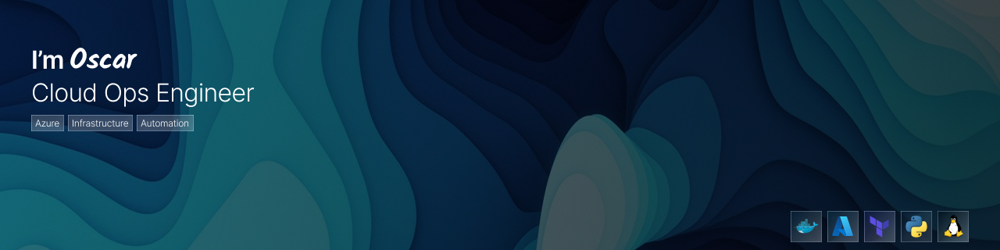

## Hi, I'm Oscar García

I’m a Computer Systems Engineering student in the final stage of my degree, currently gaining professional experience as a Cloud Operations Intern.

My current work focuses on cloud infrastructure, operational support, and deployment-related tasks. I have been involved in Azure initiatives related to virtual networks, subnets, NSGs, resource inventory, host pool cleanup, and cloud governance improvements.

I also contributed to automation and remediation planning for Azure resource tagging standards, helping improve visibility, traceability, organization, and governance across cloud environments.

I’m focused on growing in cloud infrastructure, cloud security, systems administration, automation, and security operations, while contributing to the standardization and organization of cloud environments, especially within banking and regulated industries.

📫 **oscaargarci@gmail.com** · [**LinkedIn**](https://www.linkedin.com/in/oscar-garcía-mencía-580267248)

---

### Focus Areas

---

### Cloud & Infrastructure Labs

I will be sharing hands-on labs, notes, and small projects focused on cloud infrastructure, systems administration, networking, automation, and operational practices across different cloud and Linux-based environments.

**Azure Networking & Infrastructure**  
>Labs focused on building and managing cloud infrastructure components, including networking, compute resources, access controls, and environment configuration in Azure.

**Azure Resource Inventory & Operations**  
>Projects focused on improving visibility, organization, and operational control over cloud resources through inventory, monitoring, and resource analysis practices.

**Cloud Governance & Tagging Remediation**  
>Labs focused on cloud standardization, resource organization, automation, tagging practices, and remediation strategies to support better governance and traceability.

**Linux, RHEL & Docker Administration**
>Practical labs focused on Linux-based environments, system administration, services, permissions, troubleshooting, and container fundamentals.

**OCI, AWS & Multi-Cloud Foundations**
>Introductory labs focused on exploring core infrastructure services across OCI and AWS, including compute, networking, storage, identity, and basic cloud management.

---

### Repository Structure

- **[cloud-infrastructure-labs/]()** — Labs related to cloud networking, compute, Linux-based environments, containers, and multi-cloud infrastructure foundations.

- **[cloud-operations-governance/]()** — Work focused on resource management, governance, tagging standards, remediation planning, cost visibility, automation, and operational support.

- **[projects/]()** — Practical scripts, documentation, and personal projects related to cloud, infrastructure, automation, systems administration, and security fundamentals.

---

### Certifications and Training

**Completed**
- **Fundamentals of Red Hat Enterprise Linux** — Red Hat / Coursera
- **Computer Networks and Network Security** — IBM / Coursera
- **Linux and Private Cloud Administration on IBM Power Systems** — IBM / Red Hat 

**In Progress**
- **Microsoft Azure Fundamentals (AZ-900)** — *exam pending*

---

📫 **oscaargarci@gmail.com** · [**LinkedIn**](https://www.linkedin.com/in/oscar-garcía-mencía-580267248)