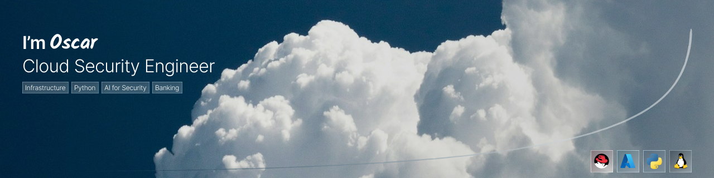

## Hi, I'm Oscar García

Computer Systems Engineering student currently in the final stage of the degree, with two academic terms remaining.

I have a foundation in IT support and infrastructure, including Windows environments, network troubleshooting, and basic systems operations.

I am currently building hands-on experience in cloud security, systems hardening, and network security through Azure labs, Windows security practice, Linux administration, and Python-based security tools.

I am seeking **internship** and **entry-level opportunities** in cloud security, systems administration, or security operations, with a strong interest in banking and other regulated environments.

I am currently progressing through the **IBM Cybersecurity Analyst** path and preparing for **Microsoft Azure Fundamentals (AZ-900)** *(exam pending)*.

📫 **oscaargarci@gmail.com** · [**LinkedIn**](https://www.linkedin.com/in/oscar-garcía-mencía-580267248)

---

### Focus Areas

-EE0000?style=flat&logo=redhat&logoColor=white)

---

### Security Labs

Hands-on labs focused on systems hardening, network controls, and foundational cloud security practices using Windows and Azure.

**Azure Secure SSH Access**  
>Secure deployment of an Azure virtual machine with restricted SSH access through network security rules.

**Azure Policy + Defender**  
>Practice in Azure governance and security posture using Policy controls and Defender recommendations.

**DHCP Server Configuration**  
>DHCP role deployment, IPv4 scope creation, exclusion ranges, and lease management on Windows Server.

**DNS Filtering**  
>Outbound DNS traffic blocking through Windows Defender Firewall using port-based rules.

**Windows Defender Hardening**  
>Basic endpoint protection validation through Microsoft Defender configuration and security checks.

**Password Policy Enforcement**  
>Local policy configuration to strengthen password requirements and improve account security.

---

### What I'm Building

- **Azure Security Labs**  
  Hands-on labs related to IAM/RBAC, monitoring, secrets management, and baseline security configurations.

- **Linux Hardening**  
  Practice focused on access control, service hardening, basic auditing, and secure administration.

- **Python Security Tools**  
  Utilities focused on analysis, validation, and small security-related automation tasks.

---

### Repository Structure

- **[cloud-security/](./cloud-security/README.md)** — Azure IAM/RBAC, monitoring, secrets, and baseline hardening
- **[security-operations/](./security-operations/README.md)** — Threat intelligence, MITRE ATT&CK, and log analysis
- **[systems-hardening/](./systems-hardening/README.md)** — Windows security, Linux hardening, access controls, and network services
- **[projects/](./projects/README.md)** — Python tools, automation, and practical projects

---

### Certifications and Training

**Completed**
- **Fundamentals of Red Hat Enterprise Linux** — Red Hat / Coursera
- **Computer Networks and Network Security** — IBM / Coursera
- **Operating Systems: Overview, Administration, and Security** — IBM / Coursera

**In Progress**
- **IBM Cybersecurity Analyst** — IBM / Coursera
- **Linux and Private Cloud Administration on IBM Power Systems** — Coursera
- **Microsoft Azure Fundamentals (AZ-900)** — *exam pending*

---

📫 **oscaargarci@gmail.com** · [**LinkedIn**](https://www.linkedin.com/in/oscar-garcía-mencía-580267248)