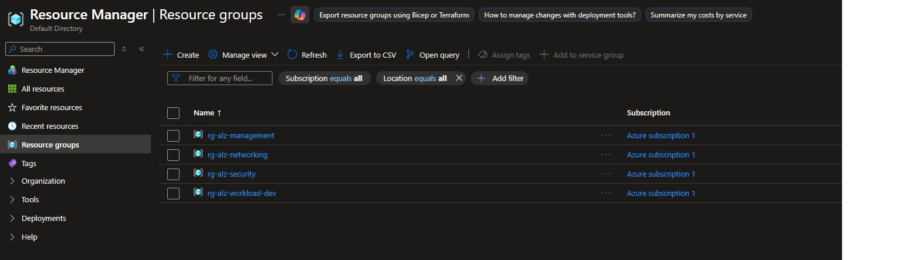
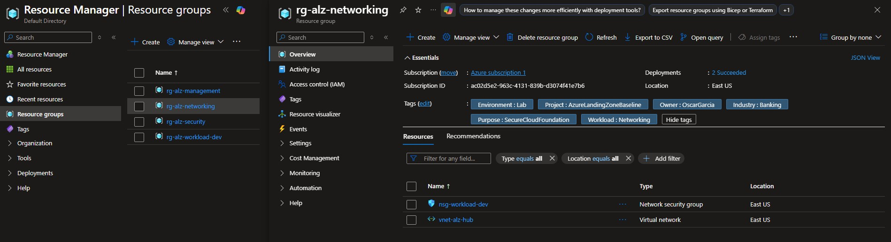
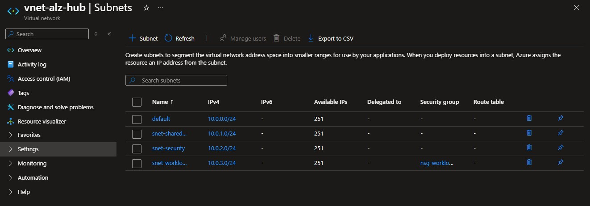
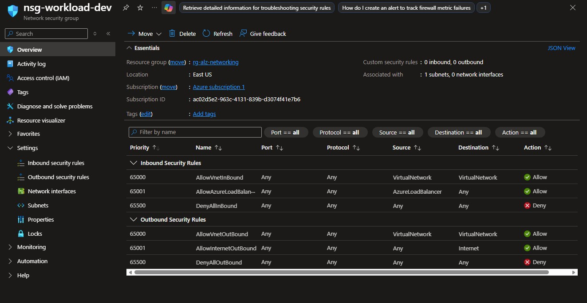
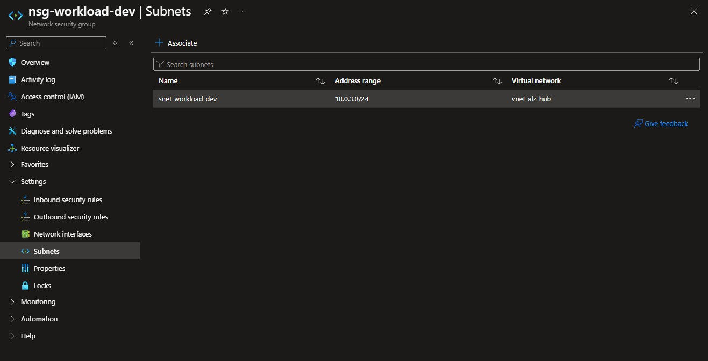
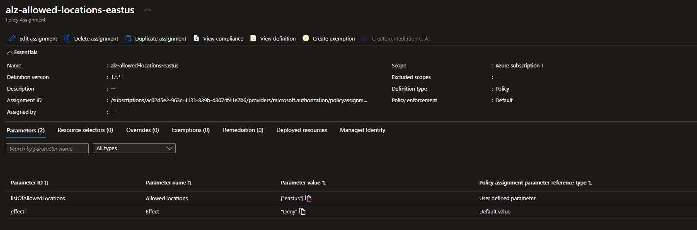
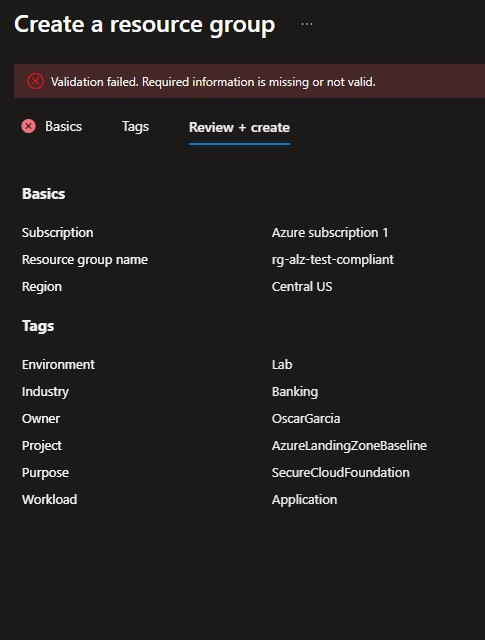
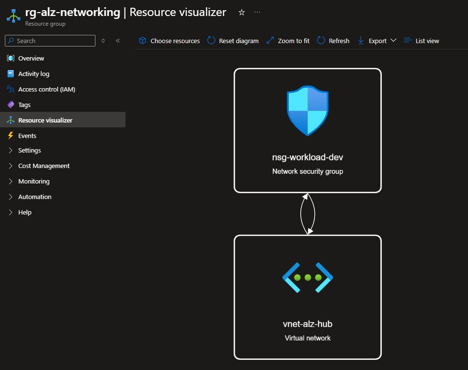

# 🧪 Hands-on Lab: Azure Landing Zone Secure Baseline

### Why this matters
A secure cloud environment should not be built without structure. Before deploying workloads, organizations need a clear baseline for governance, networking, tagging, and policy enforcement.

This lab demonstrates a simplified Azure Landing Zone baseline using Resource Groups, tags, Virtual Network segmentation, Network Security Groups, and Azure Policy. The goal is to create a basic cloud foundation that supports security, organization, and compliance from the beginning.

In banking or regulated environments, this type of baseline helps improve control over where resources are deployed, who owns them, how they are organized, and how network exposure is reduced.

---

### Objectives
- Create a basic Azure Landing Zone structure
- Separate resources by management, security, networking, and workload areas
- Apply a consistent tagging strategy
- Create a hub Virtual Network with segmented subnets
- Associate a Network Security Group to the workload subnet
- Validate that no public inbound rules are opened by default
- Assign Azure Policy controls for governance
- Enforce allowed regions for Resource Groups
- Enforce required governance tags
- Validate policy enforcement through a deny test
- Review the deployed baseline using Resource Visualizer

---

### Environment
- Cloud Provider: Microsoft Azure
- Region: East US
- Scope: Azure subscription
- Primary Services:
    - Azure Resource Groups
    - Azure Virtual Network
    - Azure Subnets
    - Network Security Group
    - Azure Policy

---

### Lab Steps (Summary)
1. Create the landing zone Resource Groups
2. Apply governance tags to the Resource Groups
3. Create the hub Virtual Network
4. Create segmented subnets
5. Create a Network Security Group
6. Associate the NSG with the workload subnet
7. Review default inbound and outbound NSG rules
8. Assign Azure Policy for allowed locations
9. Assign Azure Policy for required tags
10. Review policy assignments
11. Test policy enforcement with a blocked Resource Group deployment
12. Review the deployed architecture using Resource Visualizer

---

### Evidence

| Step | Screenshot |
|------|------------|
| Resource Groups overview |  |
| Resource Group tags |  |
| Virtual Network subnets |  |
| NSG overview and inbound rules |  |
| NSG associated subnet |  |
| Allowed locations policy assignment |  |
| Policy assignments overview |  |
| Policy deny test |  |
| Resource Visualizer |  |

---

### Resource Groups Created
The landing zone was organized using separate Resource Groups for different operational areas.
```bash
rg-alz-management       # Management and governance resources
rg-alz-security         # Security-related resources and controls
rg-alz-networking       # Core networking resources
rg-alz-workload-dev     # Development workload resources

# This structure helps keep resources organized and easier to manage as the environment grows.
```

---

### Key Takeaways
- Azure Landing Zones help create a structured foundation before deploying workloads
- Resource Groups should be organized by function, environment, or workload purpose
- Tags improve visibility, ownership, cost tracking, and governance
- Subnet segmentation helps reduce flat network design
- NSGs provide a basic layer of network traffic control
- Avoiding public inbound rules reduces unnecessary exposure
- Azure Policy can enforce governance controls before resources are deployed
- Regional restrictions are important for regulated and banking-style environments
- A secure baseline makes future cloud deployments easier to manage and audit